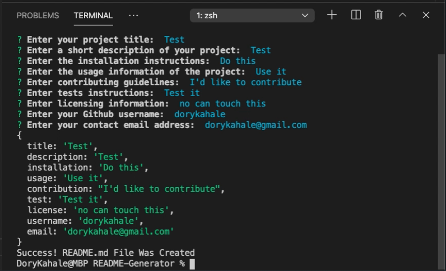

# README File Generator 
## Table of Contents
  * [Description](#Description)
  * [Questions](#Questions)

## Description
A command-line application that accepts user input
when prompted for information about your application repository, then generates a README.md file with sections entitled Description, Table of Contents, Installation, Usage, License, Contributing, Tests, and adds linkes to your github profile and email.

[Download Command Line Walkthrough Video](assets/ReadMeFileGeneratorInstructions.mov)

Add an "output" folder to your roots level for your README.md file to generate to.

README File Generator GitHub Repo: 
https://github.com/dorykahale/README-Generator

  ## Questions
  Contact Information
  Github [dorykahale](https://github.com/dorykahale)
  Email: dorykahale@gmail.com